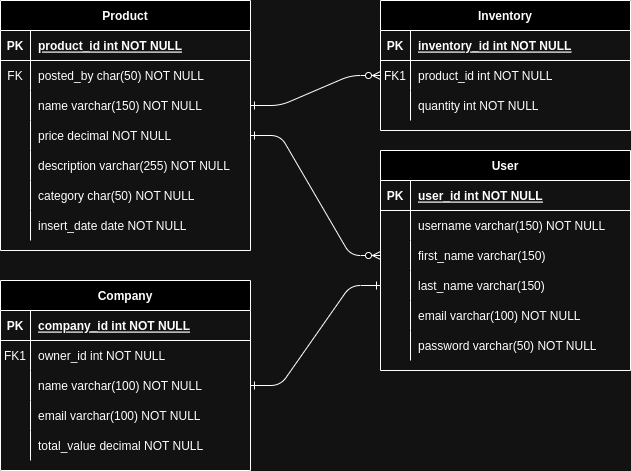

# CRM project

This is the project of a CRM (Customer Relationship Management) system developed with Django and Django Rest Framework

## System Requirements:

Create a CRM mechanism for any type of company, where it will be possible to register/remove/edit products, as well as define quantity in stock and whenever a sale is made, the stock and the total billing of the company must be updated.

Continue the CRM project, now creating your API. Create endpoints for creating an account and logging in. Create endpoints to list/register/edit/remove products and these endpoints can only be accessed if the user is “logged in”. Create an endpoint to list product details as well as inventory. Create an endpoint to list the company's billing, it should only be accessed by the company owner.

## Project Structure

The project consists of four main apps:

- `core`: Core functionalities and system authentication.
- `product`: Manages product information and inventory.
- `cart`: Specific to website functionality (not included in the API).
- `customer`: Manages customer-related data.
### Diagram



## Site

To perform CRUD operations on products or inventory, authentication is required. The website itself doesn't have authentication enabled. In order to carry out these operations, please log in to the Django administrative area, and then return to the home page. Added a simple turnaround on the system's own administration pages. A user can only, for example, enter the product registration page if he is super user. If it is not, a "Forbidden" will be raised.

## API

### EndPoints

- #### Autentication:
    - `Register:` localhost:8000/user/api/register/
    - `Login:` localhost:8000/user/api/login/token/
    - `Refresh Token:` localhost:8000/user/api/login/token/refresh/
    - `Verify Token:` localhost:8000/user/api/login/token/verify/

- #### Inventory:
    - `List:` localhost:8000/inventory/api/v1/
    - `Create:` localhost:8000/inventory/api/v1/create/
    - `Detail:` localhost:8000/inventory/api/v1/detail/id
    - `Update:` localhost:8000/inventory/api/v1/update/id
    - `Delete:` localhost:8000/inventory/api/v1/delete/id

- #### Billing:
    - `Company Billing:` localhost:8000/billing/api/v1/1/

- #### Product:
    - `List:` localhost:8000/products/api/v1/
    - `Detail:` localhost:8000/products/api/v1/id/
    - `Create:` localhost:8000/products/api/v1/create/
    - `Update:` localhost:8000/products/api/v1/update/id/
    - `Delete:` localhost:8000/products/api/v1/delete/id/

## 🥳 How to run the project: 
```
# Clone the repository
git clone https://github.com/thiagomoraiis/crm.git
cd crm

# Create and activate a virtual environment
python3 -m venv venv
source venv/bin/activate

or for Windows:

venv\Scripts\activate

# Install the dependencies
pip install -r requirements.txt 

python3 manage.py createsuperuser

python3 manage.py runserver
```

## 🎉 Documentation and Templates

This project uses the following documentation and templates:

- [Django Documentation](https://docs.djangoproject.com/en/4.1/)
- [Django REST Framework Documentation](https://www.django-rest-framework.org/)
- [Simple JWT Documentation](https://django-rest-framework-simplejwt.readthedocs.io/en/latest/)
- [MDBootstrap Templates](https://mdbootstrap.com/)
- [SB Admin 2 Template](https://startbootstrap.com/theme/sb-admin-2)